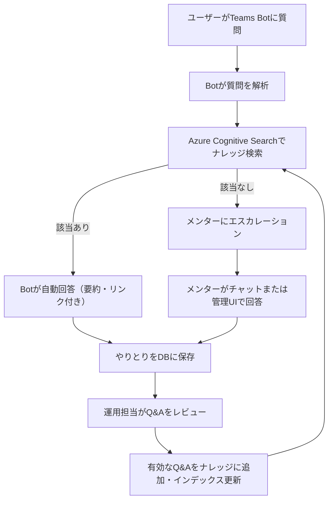
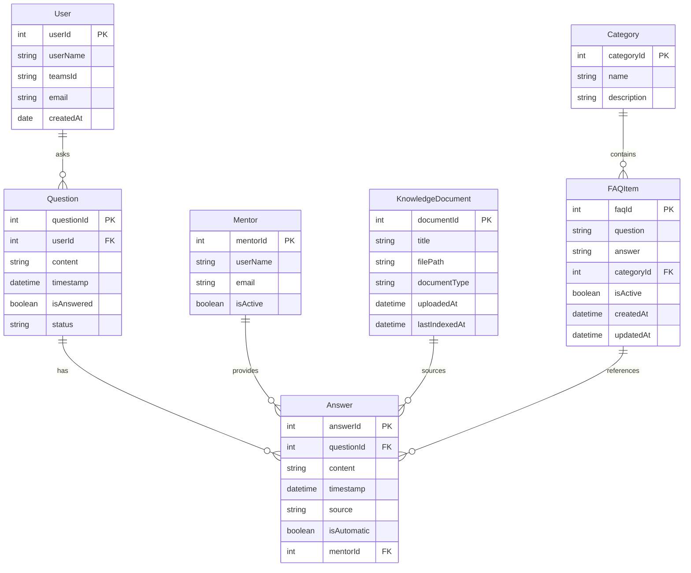
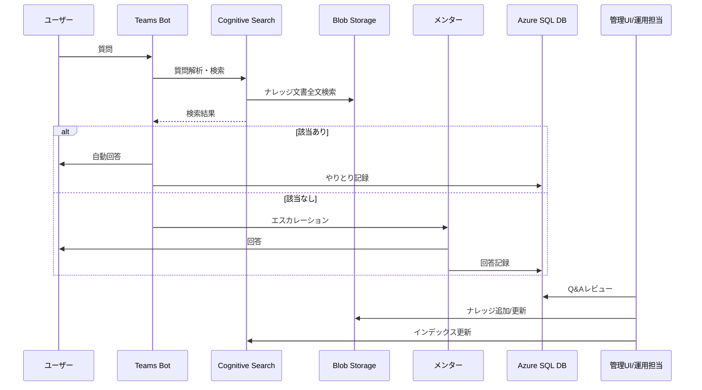

# 研修用チャットボット要件定義

## 目的
- 研修参加者がTeams上で質問できるチャットボットを提供し、事前に用意した文書やFAQから自動回答する。
- 本格運用時は、質問・回答の蓄積とナレッジの継続的な拡充を目指す。

## 技術構成（MVP）
- Microsoft Teams Bot（C#）
- Azure Cognitive Search
- 事前に用意したFAQやナレッジ文書（PDF/テキスト、Blob Storage格納）

## 機能要件
1. **ユーザー質問受付**
	- Teams Botにユーザーが自然言語で質問（例：「VPNつながらない」）
2. **質問解析・検索**
	- Botが質問内容を解析し、Azure Cognitive Searchに問い合わせ
	- ナレッジ文書（Blob Storage上のPDFやテキスト）を全文検索
3. **自動回答**
	- 該当する情報があれば、Botが要約やリンク付きで回答
	- 該当がなければ、メンターにエスカレーション
4. **メンター対応**
	- メンターがチャット上で直接回答、または管理UIから回答を登録
5. **やりとりの記録**
	- 質問内容、Botの回答（あれば）、メンターの回答、日時、ユーザー情報をDB（Azure SQL Database）に保存
6. **ナレッジ更新**
	- 運用担当がDBに溜まったQ&Aをレビューし、有効なものをテキストファイルやFAQとしてBlobに追加
	- Cognitive Searchのインデックスを更新
	- 翌年以降も同じ質問に自動回答できるようナレッジを拡充

## 非機能要件
- セキュリティ：Teams認証、Azure権限管理
- 拡張性：ナレッジ追加・インデックス更新が容易
- 保守性：Q&Aのレビュー・管理がしやすいUI

## 使用技術
- Azure SQL Database
- C#
- Teams Bot Framework
- Azure OpenAI + Cognitive Search
- Azure Blob Storage

---

# チャットボットMVPフロー（Mermaid）

---

# チャットボットシステム ER図

以下のERダイアグラムは、研修用チャットボットシステムのデータベース設計を表しています。

## エンティティの説明

### User (ユーザー)
- Teams上でチャットボットに質問するユーザー
- Teams IDと基本情報を保持

### Question (質問)
- ユーザーが投げた質問内容
- 質問日時、回答状態などを記録

### Answer (回答)
- 質問に対する回答
- 自動回答かメンター回答かを区別
- 回答の出典情報も保持

### Mentor (メンター)
- 自動回答できない質問に対応するメンター
- メンターの基本情報を管理

### KnowledgeDocument (ナレッジ文書)
- Blob Storageに保存されたPDF/テキスト文書
- 検索インデックス更新情報も保持

### FAQItem (FAQ項目)
- よくある質問と回答のセット
- カテゴリで分類可能

### Category (カテゴリ)
- FAQ項目などを分類するためのカテゴリ

---

# シーケンス図（UML）

